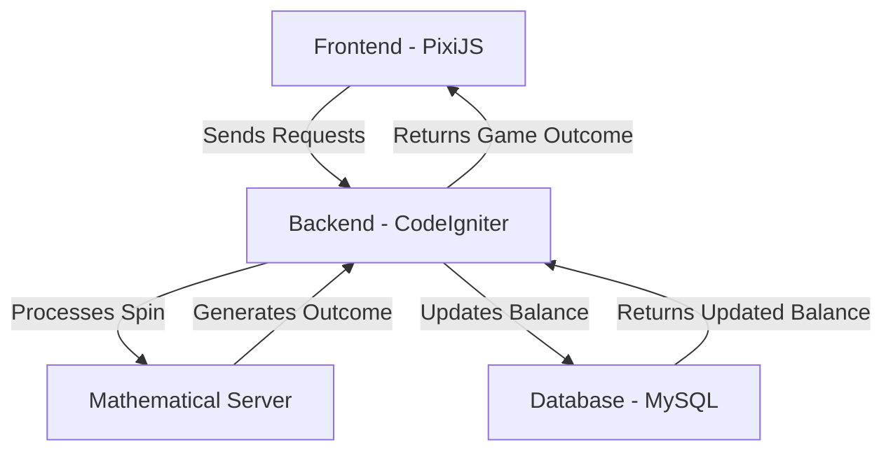
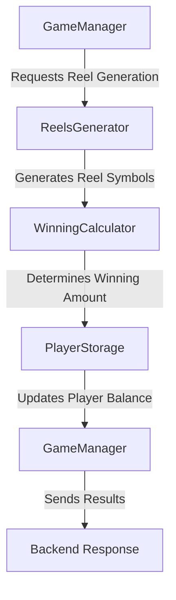

# **Slots Machine - Architecture Documentation**

## **1. Overview**

This project is a slot machine game implemented using **PixiJS** for the frontend and **CodeIgniter** for the backend. The game operates with a balance-based system and uses session management tied to a database entry for each player.

### **Abstract System Description**

The slot machine system consists of three main components:

1. **Frontend (User Interface & Interaction)**

   - Displays the game using **PixiJS**.
   - Sends spin requests to the backend and receives results.
   - Animates winning paylines and updates the player's balance visually.

2. **Backend (Game Logic & Server Routes)**

   - Manages game rounds and player balance.
   - Implements the mathematical model of the slot machine, including RTP and symbol weighting.
   - Stores player session data and handles requests.

3. **Database (Persistent Player Data)**

   - Stores player balances, session IDs, and game statistics.
   - Ensures consistency in balance updates and winnings.

### **System Diagram**


## **2. Project Structure**

### **Mathematical Server Workflow**


### **Mathematical Server Formulas**
#### **1. RTP Calculation (Return to Player):**
The RTP shows how much of the money bet will be returned to players over time:
```
RTP = (Total Wins / Total Bets) * 100%
```
- **Total Wins** – The total amount paid out to players.
- **Total Bets** – The total amount wagered by all players.
- **Target RTP Adjustment:** The system adjusts symbol probabilities dynamically to maintain the target RTP:
```
AdjustedWeight(symbol) = Weight(symbol) - ((CurrentRTP - TargetRTP) / 10)
```

#### **2. Probability of a Symbol Appearing:**
Each symbol has a chance of appearing, based on its assigned weight:
```
P(symbol) = Weight(symbol) / Total Weight
```
- **Weight of a symbol** – A predefined value determining its rarity.
- **Total Weight** – The sum of all symbol weights.

#### **3. Expected Win Calculation:**
This calculates how much a player is expected to win on average:
```
Expected Win = Σ (Probability of Line * Payout of Line)
```
- **Probability of Line** – The chance that a winning line appears.
- **Payout of Line** – The reward for hitting that line.

#### **4. Balance Update After a Spin:**
To update the player's balance after a spin:
```
New Balance = Old Balance - Bet + Winnings
```
- **Old Balance** – The player's balance before the spin.
- **Bet** – The amount wagered on the spin.
- **Winnings** – The amount won from the spin.

### **Frontend**
- `src/index.js` – Entry point; initializes PixiJS and the game scene.
- `src/SlotMachine.js` – Core slot machine logic (spins, reels, animations).
- `src/api.js` – Handles requests to the backend (`/spin`, `/balance`).
- `src/config.js` – Contains game configuration (URLs, assets, sounds).
- `src/WinningLines.js` – Defines winning paylines and checks if a spin results in a win.
- Other files handle UI elements like `SpinButton.js`, `RestartButton.js`.

### **Backend**
- `index.php` – Main entry point for the CodeIgniter framework.
- `application/controllers/Game.php` – Handles requests (`/spin`, `/balance`, `/restart`).
- `application/models/GameManager.php` – Controls game flow and logic.
- `application/models/ReelsGenerator.php` – Generates random slot reels based on RTP settings.
- `application/models/WinningCalculator.php` – Calculates winnings based on paylines and symbols.
- `application/models/PlayerStorage.php` – Manages player sessions and balance.
- `application/config/game.php` – Stores game settings like RTP, paylines, and symbol weights.

## **3. System Architecture**

### **Mathematical Server (Game Logic)**
The core game logic is handled by the backend, which includes:
1. **Reels Generation (`ReelsGenerator.php`)** – Determines the symbols on the reels based on predefined symbol weights and the targeted RTP (Return to Player).
2. **Winning Calculation (`WinningCalculator.php`)** – Uses predefined paylines and the paytable to calculate winnings.
3. **Balance Management (`PlayerStorage.php`)** – Updates the player’s balance based on game results.

#### **RTP & Fairness**
- **Return to Player (RTP)** is set in the configuration (`game.php`). It ensures a controlled payout percentage over time.
- **Symbol Weights** define the probability of each symbol appearing, influencing the hit frequency and variance.
- The logic ensures fairness by using controlled randomness while maintaining profitability.

### **Frontend to Backend Communication**
The frontend communicates with the backend using HTTP requests:
- **`POST /spin`** – Sends a bet amount, receives spin results and balance update.
- **`GET /balance`** – Fetches the current player balance.
- **`POST /restart`** – Resets the game state.

### **Backend Flow**
1. The **Game Controller (`Game.php`)** receives requests.
2. The **Game Manager (`GameManager.php`)** coordinates the game logic.
3. The **Reels Generator (`ReelsGenerator.php`)** generates the slot symbols.
4. The **Winning Calculator (`WinningCalculator.php`)** determines the win amount.
5. The **Player Storage (`PlayerStorage.php`)** updates the player’s balance.
6. The response is sent back to the frontend.

## **4. Database Structure**

The MySQL database stores player data with the following schema:

#### **Players Table (`players`)**
| Column           | Type        | Description |
|-----------------|------------|-------------|
| `id`            | INT (PK)    | Primary Key, Auto Increment |
| `session_id`    | VARCHAR(128) | Unique session identifier |
| `balance`       | FLOAT       | Player’s current balance (default 1000.00) |
| `total_bets`    | FLOAT       | Total amount bet by the player (default 0) |
| `total_wins`    | FLOAT       | Total winnings of the player (default 0) |
| `total_spins`   | INT         | Total spins played (default 0) |
| `winning_spins` | INT         | Number of winning spins (default 0) |

## **5. Deployment & Development Workflow**
- The project runs inside **Docker**.
- No CI/CD pipeline is set up.
- Uses **Make commands** for local development and deployment.

## **6. Future Improvements**
- Implement logging and error tracking.
- Add RTP validation to ensure fairness.
- Consider implementing a WebSocket-based event system.

